<div align="center">
  <svg width="450" height="100" xmlns="http://www.w3.org/2000/svg">
    <defs>
      <linearGradient id="modern-gradient" x1="0%" y1="0%" x2="100%" y2="0%">
        <stop offset="0%" style="stop-color:#3382FF;stop-opacity:1" />
        <stop offset="100%" style="stop-color:#8E44AD;stop-opacity:1" />
      </linearGradient>
    </defs>
    <text x="50%" y="55%" dominant-baseline="middle" text-anchor="middle"
          font-family="Segoe UI, Roboto, Helvetica, Arial, sans-serif"
          font-size="72" font-weight="bold" fill="url(#modern-gradient)">
      GithubBot
    </text>
  </svg>
  <p><strong>An open-source, LLM-based intelligent analysis bot for GitHub repositories</strong></p>
  <p>Chat with your codebase, gain deep insights, and automate code understanding</p>

  <p>
  <a href="https://github.com/oGYCo/GithubBot/blob/main/LICENSE"></a>
  <a href="https://python.org"></a>
  <a href="https://fastapi.tiangolo.com/"></a>
  <a href="https://www.docker.com/"></a>
</p>
</div>

---
**Note: This project is currently under active development and is not yet ready for production use.**

**GithubBot** is a powerful AI framework designed to revolutionize how developers interact with codebases. It automatically "learns" an entire GitHub repository—including all its code and documentation—and answers any questions about it in natural language through an intelligent chatbot, from "What does this function do?" to "How do I implement a new feature?".

## 🚀 Core Features

- **🤖 Intelligent Code Q&A**: Provides precise, context-aware code explanations and suggestions based on Retrieval-Augmented Generation (RAG).
- **⚡️ Fully Automated Processing**: Simply provide a GitHub repository URL to automatically clone, parse, chunk, vectorize, and index the code.
- **🔌 Highly Extensible**: Easily swap or extend LLMs, embedding models, and vector databases. Supports various models like OpenAI, Azure, Cohere, and HuggingFace.
- **🔍 Hybrid Search**: Combines vector search with BM25 keyword search to ensure optimal context retrieval for various types of queries.
- **⚙️ Asynchronous Task Handling**: Uses Celery and Redis to manage time-consuming repository indexing tasks, ensuring API responsiveness and stability.
- **🐳 One-Click Deployment**: Comes with a complete Docker Compose setup, allowing you to launch all services (API, Worker, databases, etc.) with a single command.

## 🏗️ Architecture Overview

GithubBot uses a modern microservices architecture to ensure system scalability and maintainability. The core process is divided into two stages: **"Data Ingestion"** and **"Query Answering"**.

```mermaid
graph TD
    subgraph Data Ingestion Flow
        A[1. User submits repo URL via API] --> B{2. API Service};
        B --> C[3. Create Celery async task];
        C --> D((4. Redis Message Queue));
        D --> E[5. Celery Worker receives task];
        E --> F[6. Git Helper clones repo];
        F --> G[7. File Parser parses/chunks];
        G --> H[8. Embedding Manager generates vectors];
        H --> I((9. ChromaDB Vector Store));
        H --> J((10. PostgreSQL for Metadata));
    end

    subgraph Query Answering Flow
        K[1. User asks a question via API] --> L{2. API Service};
        L --> M[3. Query Service handles request];
        M --> N[4. Hybrid Search];
        N --> O((ChromaDB));
        N --> P((BM25 Retriever));
        O --> Q[5. Retrieve relevant code chunks];
        P --> Q;
        Q --> R[6. LLM Manager builds context];
        R --> S[7. Call LLM to generate answer];
        S --> T[8. Return answer to user];
    end

    style I fill:#228B22,stroke:#333,stroke-width:2px
    style J fill:#4682B4,stroke:#333,stroke-width:2px
    style O fill:#228B22,stroke:#333,stroke-width:2px
```



## 🛠️ Tech Stack

- **Backend**: FastAPI, Python 3.10+
- **AI / RAG**: LangChain, OpenAI, Cohere, HuggingFace (extendable)
- **Database**: PostgreSQL (metadata), ChromaDB (vector storage)
- **Task Queue**: Celery, Redis
- **Containerization**: Docker, Docker Compose
- **Data Validation**: Pydantic

## 🚀 Quick Start

You can get GithubBot up and running in minutes with Docker.

### 1. Prerequisites

- **Docker**: [Install Docker](https://docs.docker.com/get-docker/)
- **Docker Compose**: Usually included with Docker Desktop.
- **Git**: To clone this project.

### 2. Clone the Project

```bash
git clone https://github.com/oGYCo/GithubBot.git
cd GithubBot
```

### 3. Configure Environment

The project uses a `.env` file to manage sensitive information and configurations. **Please note: The project includes a `.env.example` file. You need to create your own `.env` file from it.**

```bash
cp .env.example .env
```

Then, edit the `.env` file and add at least your OpenAI API key:

```dotenv
# .env

# --- LLM and Embedding Model API Keys ---
# At least one model key is required
OPENAI_API_KEY="sk-..."
# AZURE_OPENAI_API_KEY=
# ANTHROPIC_API_KEY=
# ... other API keys
```

### 4. Launch Services

Build and start all services with a single command using Docker Compose:

```bash
docker-compose up --build -d
```

This command will start the API service, Celery worker, PostgreSQL, Redis, and ChromaDB.

### 5. Check Status

Wait a moment for the services to initialize, then check if all containers are running correctly:

```bash
docker-compose ps
```

You should see the status of all services as `running` or `healthy`.

## 📖 API Usage Example

Once the services are running, the API will be available at `http://localhost:8000`. You can access the interactive API documentation (Swagger UI) at `http://localhost:8000/docs`.

### 1. Index a New Repository

Send a `POST` request to the following endpoint to start analyzing a repository. This is an asynchronous operation, and the API will immediately return a task ID.

- **URL**: `/api/v1/repositories/`
- **Method**: `POST`
- **Body**:

```json
{
  "repo_url": "https://github.com/tiangolo/fastapi"
}
```

**Example (using cURL):**

```bash
curl -X 'POST' \
  'http://localhost:8000/api/v1/repositories/' \
  -H 'accept: application/json' \
  -H 'Content-Type: application/json' \
  -d '{
  "repo_url": "https://github.com/tiangolo/fastapi"
}'
```

### 2. Check Analysis Status

Use the `session_id` returned from the previous step to check the analysis progress.

- **URL**: `/api/v1/repositories/{session_id}/status`
- **Method**: `GET`

### 3. Chat with the Repository

Once the repository status changes to `COMPLETED`, you can start asking questions.

- **URL**: `/api/v1/repositories/{session_id}/query`
- **Method**: `POST`
- **Body**:

```json
{
  "query": "How to handle CORS in FastAPI?"
}
```

**Example (using cURL):**

```bash
curl -X 'POST' \
  'http://localhost:8000/api/v1/repositories/{your_session_id}/query' \
  -H 'accept: application/json' \
  -H 'Content-Type: application/json' \
  -d '{
  "query": "How to handle CORS in FastAPI?"
}'
```

## ⚙️ Environment Configuration Details

You can customize almost every aspect of the application in the `.env` file.

| Variable Name | Description | Default Value |
| :--- | :--- | :--- |
| `API_PORT` | Port for the API service to listen on | `8000` |
| `POSTGRES_USER` | PostgreSQL username | `user` |
| `POSTGRES_PASSWORD` | PostgreSQL password | `password` |
| `REDIS_HOST` | Redis service address | `redis` |
| `OPENAI_API_KEY` | OpenAI API key | `""` |
| `CHUNK_SIZE` | Maximum size of text chunks | `1000` |
| `CHUNK_OVERLAP` | Overlap size between text chunks | `200` |
| `VECTOR_SEARCH_TOP_K` | Number of documents from vector search | `10` |
| `BM25_SEARCH_TOP_K` | Number of documents from BM25 search | `10` |
| `ALLOWED_FILE_EXTENSIONS` | List of allowed file extensions | (see `config.py`) |
| `EXCLUDED_DIRECTORIES` | List of directories to ignore | `.git,node_modules,...` |

## 🤝 Contributing

Contributions of all kinds are welcome! Whether it's reporting a bug, submitting a feature request, or contributing code.

1.  Fork the Project
2.  Create your Feature Branch (`git checkout -b feature/AmazingFeature`)
3.  Commit your Changes (`git commit -m 'Add some AmazingFeature'`)
4.  Push to the Branch (`git push origin feature/AmazingFeature`)
5.  Open a Pull Request

## 📄 License

This project is licensed under the MIT License. See the [LICENSE](LICENSE) file for details.
