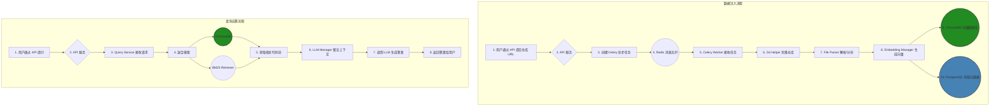

<div align="center">
  <svg width="450" height="100" xmlns="http://www.w3.org/2000/svg">
    <defs>
      <linearGradient id="modern-gradient" x1="0%" y1="0%" x2="100%" y2="0%">
        <stop offset="0%" style="stop-color:#3382FF;stop-opacity:1" />
        <stop offset="100%" style="stop-color:#8E44AD;stop-opacity:1" />
      </linearGradient>
    </defs>
    <text x="50%" y="55%" dominant-baseline="middle" text-anchor="middle"
          font-family="Segoe UI, Roboto, Helvetica, Arial, sans-serif"
          font-size="72" font-weight="bold" fill="url(#modern-gradient)">
      GithubBot
    </text>
  </svg>
  <p><strong>一个开源的、基于 LLM 的 GitHub 仓库智能分析机器人</strong></p>
  <p>与您的代码库进行对话、获取深度洞见、自动化代码理解</p>

  <p>
  <a href="https://github.com/oGYCo/GithubBot/blob/main/LICENSE"></a>
  <a href="https://python.org"></a>
  <a href="https://fastapi.tiangolo.com/"></a>
  <a href="https://www.docker.com/"></a>
</p>
</div>

---
**请注意，目前项目仍在开发中，还无法正常使用**

**GithubBot** 是一个功能强大的 AI 框架，旨在彻底改变开发者与代码库的交互方式。它能够自动“学习”一个 GitHub 仓库的全部代码和文档，并通过一个智能聊天机器人，用自然语言回答关于该仓库的任何问题——从“这个函数是做什么的？”到“如何实现一个新功能？”。

## 🚀 核心功能

- **🤖 智能代码问答**: 基于检索增强生成（RAG）技术，提供精准的、上下文感知的代码解释和建议。
- **⚡️ 全自动处理**: 只需提供一个 GitHub 仓库 URL，即可自动完成代码克隆、解析、分块、向量化和索引。
- **🔌 高度可扩展**: 轻松更换或扩展 LLM、Embedding 模型和向量数据库，支持 OpenAI、Azure、Cohere、HuggingFace 等多种模型。
- **🔍 混合搜索**: 结合了向量搜索和 BM25 关键字搜索，确保在不同类型的查询下都能获得最佳的上下文检索效果。
- **⚙️ 异步任务处理**: 使用 Celery 和 Redis 处理耗时的仓库索引任务，确保 API 服务的响应速度和稳定性。
- **🐳 一键部署**: 完整的 Docker-Compose 配置，一行命令即可启动所有服务（API、Worker、数据库等）。

## 🏗️ 架构概览

GithubBot 采用现代化的微服务架构，确保系统的可伸缩性和可维护性。核心流程分为 **“数据注入”** 和 **“查询应答”** 两个阶段。



## 🛠️ 技术栈

- **后端**: FastAPI, Python 3.10+
- **AI / RAG**: LangChain, OpenAI, Cohere, HuggingFace (可扩展)
- **数据库**: PostgreSQL (元数据), ChromaDB (向量存储)
- **任务队列**: Celery, Redis
- **容器化**: Docker, Docker Compose
- **数据校验**: Pydantic

## 🚀 快速开始

通过 Docker，您可以在几分钟内启动并运行 GithubBot。

### 1. 环境准备

- **Docker**: [安装 Docker](https://docs.docker.com/get-docker/)
- **Docker Compose**: 通常随 Docker Desktop 一起安装。
- **Git**: 用于克隆本项目。

### 2. 克隆项目

```bash
git clone https://github.com/oGYCo/GithubBot.git
cd GithubBot
```

### 3. 环境配置

项目通过 `.env` 文件管理敏感信息和配置。 **请注意：项目中已经包含了 `.env.example` 文件，您需要手动创建 `.env` 文件。**

然后，编辑 `.env` 文件，至少填入您的 OpenAI API 密钥：

```dotenv
# .env

# --- LLM 和 Embedding 模型 API Keys ---
# 至少需要提供一个模型的 Key
OPENAI_API_KEY="sk-..."
# AZURE_OPENAI_API_KEY=
# ANTHROPIC_API_KEY=
# ... 其他 API Keys
```

### 4. 启动服务

使用 Docker Compose 一键构建并启动所有服务：

```bash
docker-compose up --build -d
```

该命令会启动 API 服务、Celery Worker、PostgreSQL、Redis 和 ChromaDB。

### 5. 检查状态

等待片刻，然后检查所有容器是否正常运行：

```bash
docker-compose ps
```

您应该能看到所有服务的状态为 `running` 或 `healthy`。

## 📖 API 使用示例

服务启动后，API 将在 `http://localhost:8000` 上可用。您可以访问 `http://localhost:8000/docs` 查看交互式 API 文档 (Swagger UI)。

### 1. 索引一个新的仓库

向以下端点发送 `POST` 请求，开始分析一个仓库。这是一个异步操作，API 会立即返回一个任务 ID。

- **URL**: `/api/v1/repositories/`
- **Method**: `POST`
- **Body**:

```json
{
  "repo_url": "https://github.com/tiangolo/fastapi"
}
```

**示例 (使用 cURL):**

```bash
curl -X 'POST' \
  'http://localhost:8000/api/v1/repositories/' \
  -H 'accept: application/json' \
  -H 'Content-Type: application/json' \
  -d '{
  "repo_url": "https://github.com/tiangolo/fastapi"
}'
```

### 2. 查询分析状态

使用上一步返回的 `session_id` 来检查仓库的分析进度。

- **URL**: `/api/v1/repositories/{session_id}/status`
- **Method**: `GET`

### 3. 与仓库对话

当仓库状态变为 `COMPLETED` 后，您就可以开始提问了。

- **URL**: `/api/v1/repositories/{session_id}/query`
- **Method**: `POST`
- **Body**:

```json
{
  "query": "How to handle CORS in FastAPI?"
}
```

**示例 (使用 cURL):**

```bash
curl -X 'POST' \
  'http://localhost:8000/api/v1/repositories/{your_session_id}/query' \
  -H 'accept: application/json' \
  -H 'Content-Type: application/json' \
  -d '{
  "query": "How to handle CORS in FastAPI?"
}'
```

## ⚙️ 环境配置详解

您可以在 `.env` 文件中自定义应用的几乎所有方面。

| 变量名 | 描述 | 默认值 |
| :--- | :--- | :--- |
| `API_PORT` | API 服务监听的端口 | `8000` |
| `POSTGRES_USER` | PostgreSQL 用户名 | `user` |
| `POSTGRES_PASSWORD` | PostgreSQL 密码 | `password` |
| `REDIS_HOST` | Redis 服务地址 | `redis` |
| `OPENAI_API_KEY` | OpenAI API 密钥 | `""` |
| `CHUNK_SIZE` | 文本分块的最大尺寸 | `1000` |
| `CHUNK_OVERLAP` | 文本分块之间的重叠尺寸 | `200` |
| `VECTOR_SEARCH_TOP_K` | 向量搜索返回的文档数 | `10` |
| `BM25_SEARCH_TOP_K` | BM25 搜索返回的文档数 | `10` |
| `ALLOWED_FILE_EXTENSIONS` | 允许处理的文件扩展名列表 | (见 `config.py`) |
| `EXCLUDED_DIRECTORIES` | 忽略的目录列表 | `.git,node_modules,...` |

## 🤝 贡献

我们欢迎任何形式的贡献！无论是报告 Bug、提交功能请求还是直接贡献代码。

1.  Fork 本仓库
2.  创建您的功能分支 (`git checkout -b feature/AmazingFeature`)
3.  提交您的更改 (`git commit -m 'Add some AmazingFeature'`)
4.  推送到分支 (`git push origin feature/AmazingFeature`)
5.  开启一个 Pull Request

## 📄 许可证

本项目采用 MIT 许可证。详情请见 [LICENSE](LICENSE) 文件。

